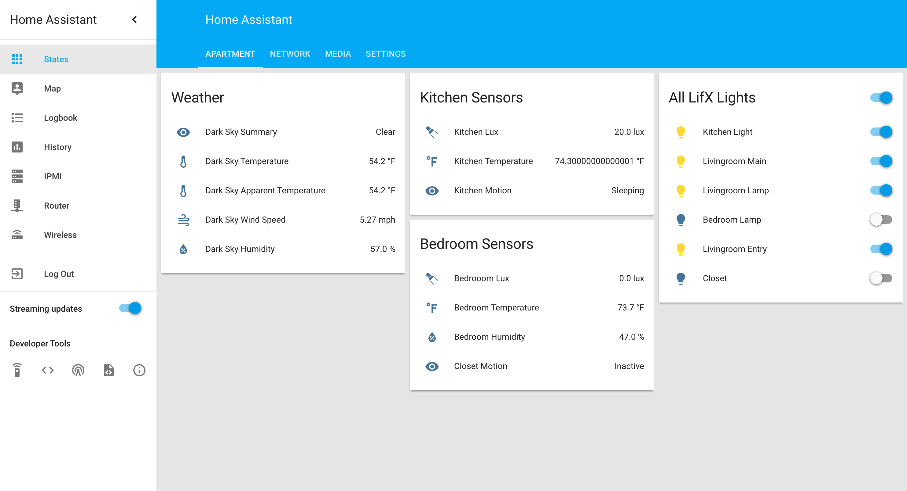

## Home Assistant Config

A copy of my home-assistant.io configuration.

**List of devices:**

* [2 x Amazon Echo Dot](http://a.co/2VXsmqD)
* [2 x LIFX Color 1000 BR30](http://a.co/7dqYzZx)
* [2 x LIFX White 900 BR30](http://a.co/2Y11OyH)
* [8 x LIFX White 800 A19](http://a.co/4z3xDqO)
* [Aeotec MultiSensor 6](http://a.co/8DRpbBZ)
* [Fibaro Motion Sensor](http://a.co/iLA5NCI)
* [Aeotec z-stick](http://a.co/ahoCSXm)
* [Roku](http://amzn.to/2dpn89c)
* [Amazon Fire TV Stick](http://a.co/hO2j7Rt)
* [LinkNode](http://a.co/418sNIw)

**Automations:**

* Trigger Livingroom Lights from ESP8266 connected to physical switch.
* Trigger Bedroom Lights from ESP8266 connected to physical switch.
* Trigger Kitchen Lights via Fibaro motion sensor.
* Trigger Closet Lights via Aeotec multisensor.
* Save the state of the lights if I am away. If I return within an hour turn lights back to that state, otherwise turn on livingroom lights when I get home.
* When Alexa Alarm goes off turn on the bedroom lamp.
* If alarm is snoozed more than three times start flashing bedroom lamp.
* Setup notifications for alexa flash breifing. If motion is triggered while away, tell me. If UPS goes onto battery power, tell me. If device goes off line, tell me.

**Alexa Flash Briefing:**
* Weather - Tell me if I need a jacket/coat/umbrella
* Traffic - Tell me traffic to school.
* Events - Tell me my next calendar event.
* Home Status - Notifications for states.

### Screenshots

#Todo List
* Fix Lifx LAN API.
* Create some ESP8266 motion sensors.
* Brightness, hue, temperature light control depending on time of day and weather conditions.
* Control projector via alexa. (I.E - "Alexa, play game of thrones")
* Clean up alexa flash briefing code. 
* Secure the server better.