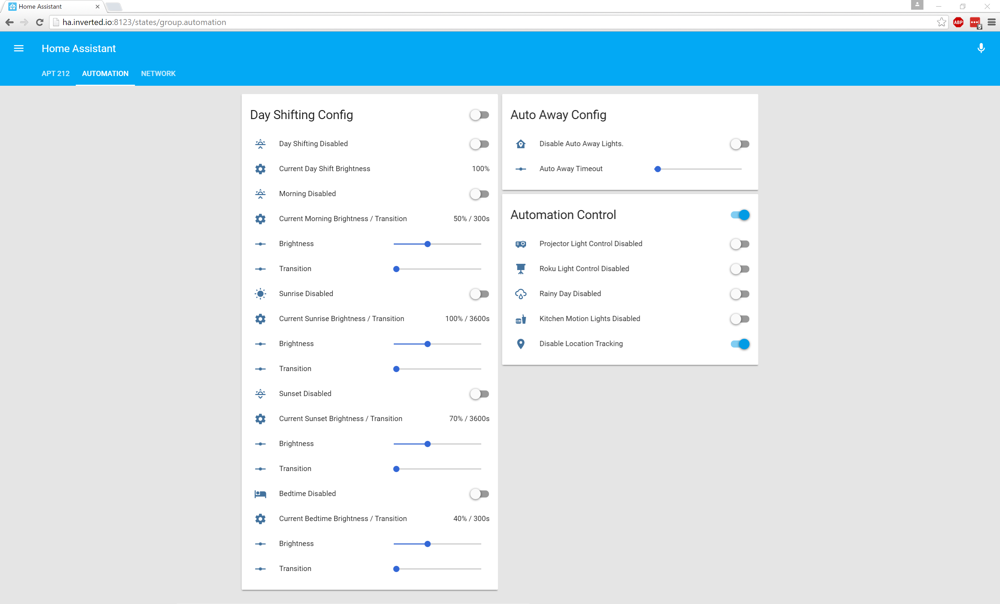

## Home Assistant Config

A copy of my home-assistant.io configuration.

### List of Automations
1) __Day Shifting__ - Controling the brightness of connected Lifx bulbs via the time of day and sunrise and sunset.

2) __Auto Away__ - Turns off lights when I leave my apartment while storing their state. If I return within one hour it will turn the lights back on that were on before I left. Otherwise it turns on the main livingroom light only.

3) __Projector/Roku Lighting__ - Dims specific lights based on the state of my projector which is controlled via an MQTT ESP8266. It also determines the state of my roku and will slowly dim the remaining lights when the roku beigns to play media.

4) __Kitchen Motion__ - Controls the lights in my kitchen based on input from a Fibaro Multi-Sensor. Brightness level is determined by the time of day set by the Day Shifting automation.

5) __Master/Bedroom Switch__ - Two physical swtiches wired to an MQTT ESP8266 that control the livingroom lights and bedroom lights without the need to open an app.

### Design Choices
I wanted to ensure that all automation tasks could be easily turned off, so the config also includes a great deal of input_boolen's and conditions to deal with disabling specific automation tasks. There is also a great deal of work that went into ensuring the ability to see the state of the system quickly via the Web UI. Sliders, sensor templates and input boolen's were all used to get the desired effect. 

In the Day Shifting automations, there is a bunch of actions that deal with setting the brightness of the lights if they're off, this config code can be replaced once a method to change the state of the lights without turning them on is implimented. I am working on code for this here: [Add set_brightness as a service](https://github.com/home-assistant/home-assistant/pull/2335)

### Screenshots

